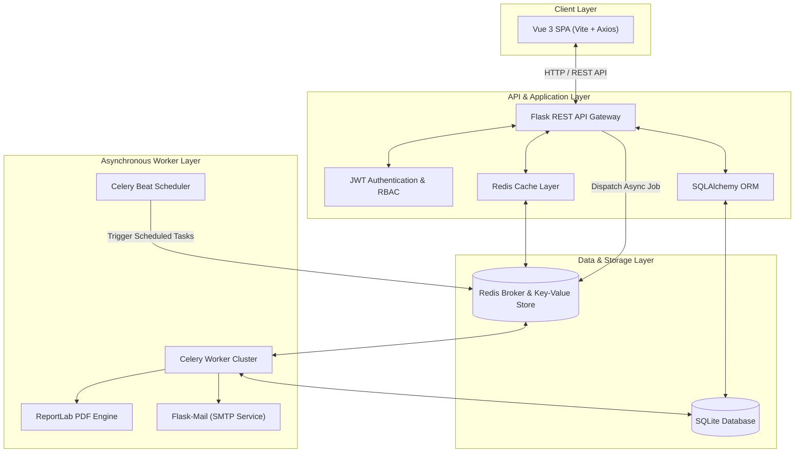
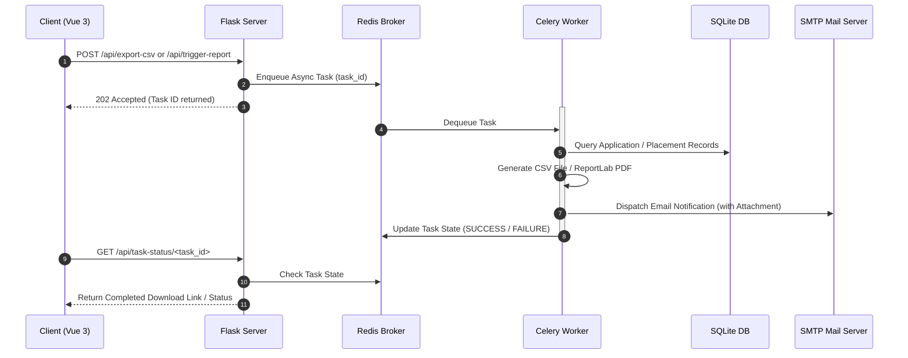

# 🎓 Enterprise Placement Portal Application (V2)

[](https://python.org)
[](https://flask.palletsprojects.com/)
[](https://vuejs.org/)
[](https://vitejs.dev/)
[](https://redis.io/)
[](https://docs.celeryq.dev/)
[](https://www.gnu.org/licenses/gpl-3.0)

A high-performance, asynchronous full-stack web application designed to streamline campus recruitment and placement workflows. Built as part of the **Modern Application Development II (MAD-II)** curriculum at **IIT Madras**, this platform connects **Students**, **Corporate Recruiters**, and **Placement Administrators** through real-time application tracking, role-based access control, distributed caching, and automated background jobs.

---

## 🏗️ System Architecture

The application is architected around a decoupled **Single Page Application (SPA)** frontend communicating with a RESTful Flask micro-service backend. Heavy computing operations (PDF generation, bulk CSV exports, scheduled email notifications) are offloaded to an asynchronous **Celery worker cluster** backed by **Redis**.



---

## ⚡ Asynchronous Task Flow

To maintain high throughput and prevent blocking the main HTTP request-response thread, long-running operations execute asynchronously via **Celery**.



---

## 🚀 Key Modules & Technical Capabilities

### 🔐 1. Role-Based Access Control (RBAC) & Security
* **JWT-Based Authentication**: Stateless session management via `flask-jwt-extended`.
* **Password Security**: Irreversible salted password hashing using `werkzeug.security`.
* **Multi-Tenant Roles**:
  * **Students**: Browse job drives, filter by eligibility, apply with resume attachments, track status in real-time, and trigger asynchronous CSV data exports.
  * **Companies**: Register company profiles (subject to admin verification), post job openings with salary/skill criteria, review candidate applications, shortlist candidates, and download placement analytics PDFs.
  * **Administrators**: System-wide control panel to verify company credentials, manage user roles, audit active job listings, and monitor placement statistics.

### ⚡ 2. Redis Caching & Invalidation Strategy
* **Read-Heavy Optimization**: Frequently accessed endpoints (such as active job listings, student profile dashboards, and company directories) are cached in Redis via `Flask-Caching`.
* **Smart Cache Invalidation**: Caches automatically purge or refresh upon model mutations (e.g., when a company posts a new job or an admin approves a recruiter profile) to prevent stale data reads.

### 📬 3. Scheduled & Background Tasks (Celery + Celery Beat)
* **Automated Interview Reminders**: Celery Beat runs periodic cron schedules to scan upcoming interview dates and send HTML email notifications via SMTP.
* **Asynchronous Data Exports**: Students can request full application history exports without HTTP timeouts; Celery processes the dataset in the background and notifies the student.
* **Analytical PDF Generation**: Automated PDF generation using **ReportLab**, building visual placement summary reports complete with candidate statistics and status distributions.

---

## 🛠️ Technology Stack

| Domain | Technology | Description |
| :--- | :--- | :--- |
| **Frontend Framework** | **Vue.js 3** | Reactive Single Page Application framework using Composition API |
| **Build Tool** | **Vite** | Lightning-fast frontend tooling and asset bundler |
| **HTTP Client** | **Axios** | Promise-based HTTP client for API interaction |
| **Backend Framework** | **Python Flask** | Lightweight WSGI web application framework |
| **ORM & Database** | **Flask-SQLAlchemy / SQLite** | Object-Relational Mapping for relational schema management |
| **Authentication** | **Flask-JWT-Extended** | Secure JSON Web Token authentication |
| **Task Queue** | **Celery** | Distributed asynchronous task queue |
| **Task Scheduler** | **Celery Beat** | Periodic cron job scheduler |
| **Cache & Message Broker** | **Redis** | In-memory key-value data store and message broker |
| **PDF Engine** | **ReportLab** | Programmatic PDF generation and layout library |

---

## 📡 REST API Reference

| Method | Endpoint | Access Level | Description |
| :--- | :--- | :--- | :--- |
| `POST` | `/api/auth/login` | Public | Authenticates user credentials and issues JWT token |
| `POST` | `/api/auth/register` | Public | Registers a new Student or Company account |
| `GET` | `/api/jobs` | Student / Admin | Fetches active job openings *(Redis Cached)* |
| `POST` | `/api/jobs` | Company | Creates a new job placement drive |
| `POST` | `/api/jobs/<id>/apply` | Student | Submits a student application for a specific job drive |
| `GET` | `/api/admin/companies/pending` | Admin | Fetches unapproved company registration requests |
| `PUT` | `/api/admin/companies/<id>/approve`| Admin | Approves a company profile for job posting |
| `POST` | `/api/export/csv` | Student | Enqueues background Celery task for CSV export |
| `POST` | `/api/reports/pdf` | Company / Admin | Triggers asynchronous ReportLab PDF generation |

---

## ⚙️ Environment Setup & Installation

### Prerequisites
Ensure you have the following installed on your host system:
* **Python 3.10+**
* **Node.js 18+** and `npm`
* **Redis Server** (`redis-server`)

---

### 1️⃣ Backend Installation

```bash
# Clone the repository
git clone https://github.com/24f3004027/Placement_Portal_Application_V2.git
cd Placement_Portal_Application_V2/backend

# Create and activate a Python virtual environment
python3 -m venv venv
source venv/bin/activate

# Install backend dependencies
pip install -r ../requirements.txt
```

---

### 2️⃣ Running Services

Open separate terminal tabs for each required process:

#### Terminal 1: Redis Server
```bash
redis-server
```

#### Terminal 2: Flask API Backend
```bash
cd backend
source venv/bin/activate
python3 app.py
```

#### Terminal 3: Celery Worker
```bash
cd backend
source venv/bin/activate
celery -A celery_worker worker --loglevel=info
```

#### Terminal 4: Celery Beat Scheduler
```bash
cd backend
source venv/bin/activate
celery -A celery_worker beat --loglevel=info
```

---

### 3️⃣ Frontend Installation & Execution

```bash
# Navigate to the frontend directory
cd Placement_Portal_Application_V2/frontend

# Install Node modules
npm install

# Launch Vite development server
npm run dev
```

Access the application in your browser at `http://localhost:5173`.

---

## 🄯 License & Open Source Ethos

Released under the **GNU General Public License v3.0 (GPLv3)**.

```text
🄯 Copyleft 2026 Ramrup Satpati (Roll No: 24f3004027). All Rights Reversed.
Free Software Foundation, Inc. <https://fsf.org/>
Everyone is permitted to copy and distribute verbatim copies of this license document.
```
